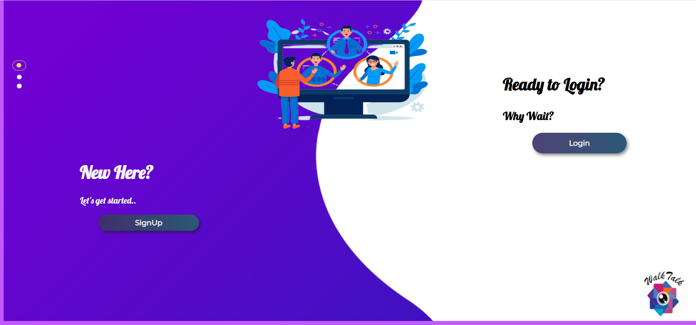
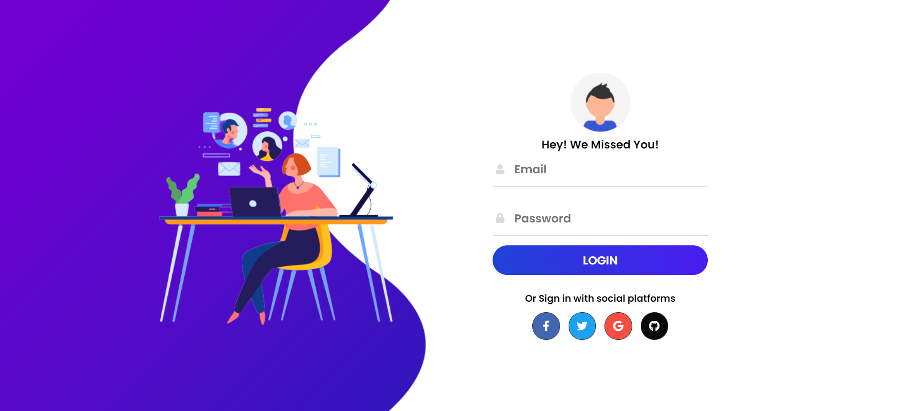
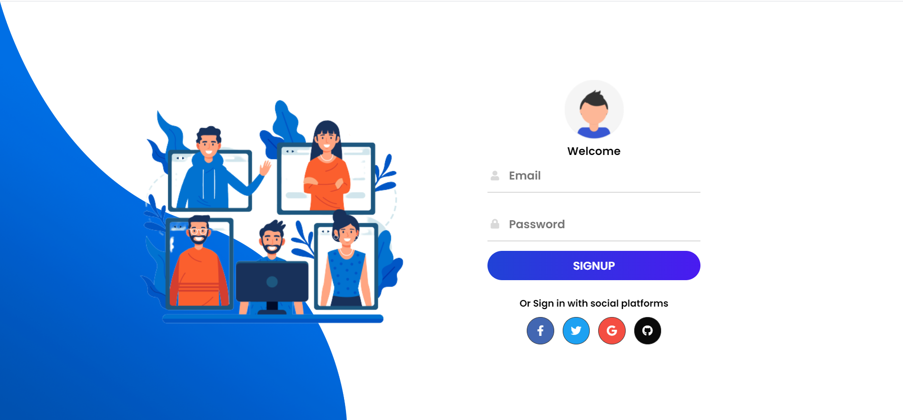
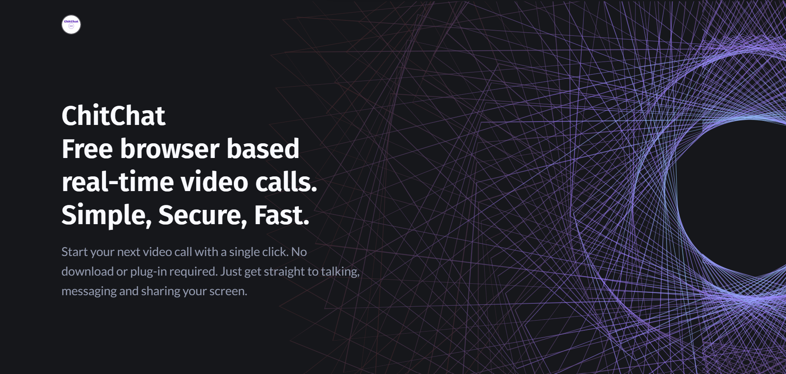

# ChitChat
Powered by WebRTC, Real-time video call, chat room and screen sharing entirely browser based

Open the app in one of following supported browser

# Relaxing UI

# Features 

* Relaxing UI/Easy to use
* Is 100% Free and Open Source
* No download or plug-in required, entirely browser based
* Unlimited number of conference rooms without call time limitation
* Desktop and Mobile compatible
* Optimized Room Url Sharing (share it to your participants, wait them to join)
* WebCam Streaming (Front - Rear for mobile)
* Audio Streaming
* Screen Sharing to present documents, slides, and more...
* File Sharing, share any files to your participants in the room
* Select Audio Input - Output && Video source
* Ability to set video quality up to 4K and adapt the FPS
* Recording your Screen, Audio and Video
* Chat with Emoji Picker & Private messages & Save the conversations
* Simple collaborative whiteboard for the teachers
* Whiteboard with different color sets with saving/deleting option
* Full Screen Mode on mouse click on the Video element
* Possibility to Change UI Themes
* Right click on the Video elements for more options
* Direct peer-to-peer connection

# Demo

* Open https://chit-chat-web-app.vercel.app/newcall
* Pick your personal Room name and Join To Room
* Allow to use the camera and microphone
* Share the Room URL with your colleagues and wait for joining them

# Steps for cloning the project

* Write git clone https://github.com/vip-suthar/chit-chat-web-app.git
* Open Folder in VSCode
* Ensure Nodejs is already installed
* Write npm install in your terminal
* Add [this(click here to download)](https://drive.google.com/file/d/15eyRS17D-4Pw3QFK92P2JbXPIWcEMSgI/view?usp=sharing) `.env` file in the root of this project.
* Write node server.js in terminal
* Open http://localhost:8000 in your browser
